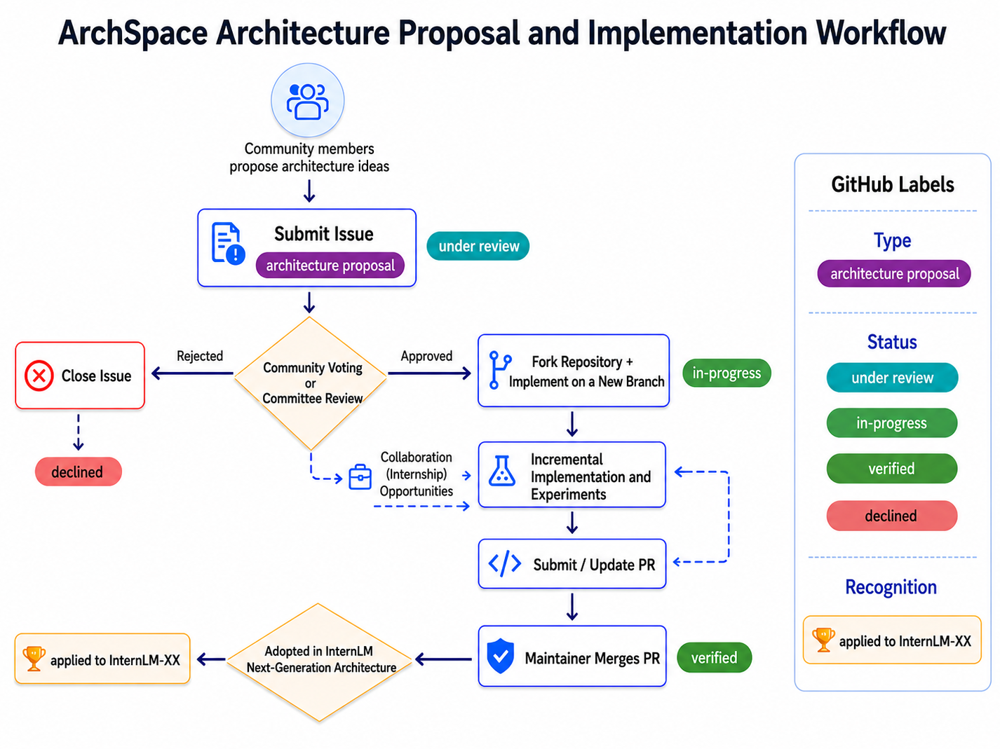
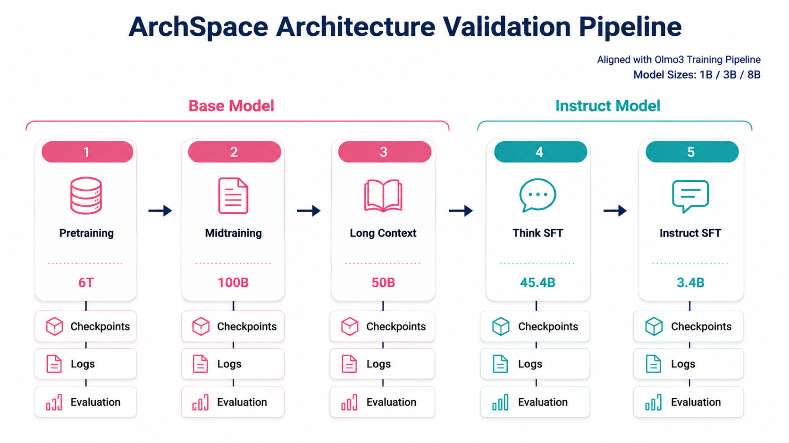

<h1 align="center"></h1>

    
    
    

<h4 align="center">
    

        <a href="README.md">English</a> |
        <a href="README_ZH.md">简体中文</a>
    

</h4>
<h3 align="center">
    
🌳 Turning LLM architecture exploration into reusable knowledge for the community. 🌳

</h3>

ArchSpace is an open experiment for large language model (LLM) architecture innovation. We place architecture hypotheses proposed by the community into transparent, traceable, and reproducible training and evaluation workflows, then turn successful findings, negative results, and design trade-offs into shared knowledge assets.

Each generation of open foundation models brings new architectural ideas. Yet their actual gains across a full training lifecycle, their operating boundaries, and the lessons from failed attempts are rarely reusable by the broader field. ArchSpace provides a public experimental ground: from a proposal issue on GitHub through peer review, implementation, training, evaluation, and publication of conclusions.

## What We Do

- **Open proposals**: Community members can submit architecture ideas worth validating.
- **Peer review**: A review committee assesses proposals for novelty, feasibility, and experimental rigor.
- **Full validation**: Approved proposals enter a unified workflow covering pretraining, instruction tuning, and reinforcement learning.
- **Open records**: Training and evaluation logs are continuously recorded and published through platforms such as Weights & Biases (W&B).
- **Shared knowledge**: Implementations, experiment records, and conclusions are made available whether results are positive, negative, or conditional.

## How to Contribute

You can participate in ArchSpace by:

1. Submit an [Issue](../../issues/new/choose) using the `architecture proposal` template to discuss an architecture innovation proposal.
2. Contributing implementations, tests, evaluations, or documentation for approved proposals.
3. Sending pull requests with incremental implementations and experiment updates.
4. Help reproduce results, verify implementation correctness, and discuss public experiment results.

⭐ Accepted proposals may receive joint appointment or internship collaboration opportunities from the lab.

🏆 Point architecture innovations adopted by the next-generation InternLM architecture will receive open-source contribution recognition from the lab and the community.

# Validation Pipeline Aligned with Olmo 3

Approved proposals are validated using a full training workflow aligned with the fully open [Olmo 3](https://arxiv.org/abs/2512.13961) model flow:

- **Model sizes**: 1B, 3B, and 8B;
- **Training stages**: pre-training, mid-training, and instruction tuning;
- **Training scale**: approximately 6.2T tokens in total across the complete workflow;
- **Process records**: training and evaluation logs are recorded and published on W&B;
- **Outputs**: implementations, configurations, metrics, experiment records, and conclusions, including architecture trade-offs and operating conditions where possible.

We value negative results. An architecture attempt that does not deliver the expected gain is still valuable when it has been clearly and rigorously validated, because it helps the community avoid redundant trial and error.

## References

- [Next Concept Prediction in Discrete Latent Space Leads to Stronger Language Models](https://arxiv.org/abs/2602.08984)
- [Olmo 3](https://arxiv.org/abs/2512.13961)
- [Keynote Speech by Xi Jinping at the Opening Ceremony of the 2026 World Artificial Intelligence Conference and High-Level Meeting on Global AI Governance](https://www.news.cn/politics/leaders/20260717/72728b6f94154d63b3eaaaf9808b51eb/c.html)
